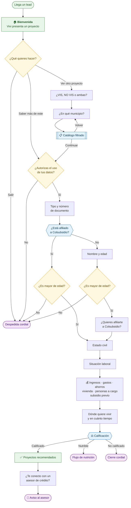

# Vivi 🏠

**Una asesora de vivienda que conversa por WhatsApp, entiende a cada persona y
solo le pasa al asesor humano los leads que de verdad pueden comprar.**

---

## El problema

Colsubsidio genera muchos leads de vivienda por pauta digital, pero hoy todos
llegan igual al asesor comercial. Solo una fracción tiene capacidad real de
compra, y el asesor lo descubre después de conversar. Se pierde pauta, se pierde
tiempo, y los leads buenos esperan en la misma fila que los que no van a cerrar.

## Qué hace Vivi

**Reconoce a la persona desde el primer mensaje.** Consulta si está afiliada a
Colsubsidio y, si lo está, no le vuelve a pedir lo que ya sabe: su categoría, su
edad y su salario base salen de la base de datos.

**Pregunta como una persona, no como un formulario.** Una pregunta a la vez, con
botones para tocar en lugar de escribir. Y si alguien responde *"8 millones"* en
vez de la opción exacta del menú, lo entiende igual.

**Califica con reglas transparentes.** El puntaje es una fórmula, no una
opinión: los mismos datos siempre dan el mismo resultado, y cada lead queda
guardado con el detalle de por qué obtuvo lo que obtuvo.

**Reparte el trabajo.** El lead calificado pasa al asesor comercial y se le
ofrece un asesor de crédito. El nutrible entra a un flujo para volver más
adelante. Nadie se queda sin respuesta.

---

## Así conversa

Las cajas amarillas son decisiones de la persona. Las azules las resuelve el
sistema solo, sin preguntar.

---

## Cómo decide

El puntaje va de 0 a 100 y se arma con seis criterios:

| Criterio | Peso | Qué mide |
|---|---:|---|
| Historial crediticio | 25 | Score de crédito |
| Afiliación a Colsubsidio | 15 | Categoría A, B o C |
| Nivel de ingresos | 20 | Ingresos del hogar |
| Ahorros disponibles | 15 | Cesantías, FNA, ahorro libre |
| Capacidad de pago | 15 | Lo que queda después de los gastos |
| Urgencia de compra | 10 | En cuánto tiempo quiere comprar |

Luego se ajusta: **+8** si tiene personas a cargo, **−15** si ya tiene vivienda
propia y busca VIS, **−5** si tiene créditos activos.

Con el resultado se clasifica:

| | Afiliado | No afiliado | Qué pasa |
|---|---:|---:|---|
| ✅ **Calificado** | 60 o más | 75 o más | Va al asesor comercial |
| 🟡 **Nutrible** | 30 a 59 | 30 a 74 | Entra a nutrición |
| ⚪ **No calificado** | menos de 30 | menos de 30 | Cierre cordial |

> **Dos reglas mandan sobre el puntaje.** Quien ya recibió un subsidio de
> vivienda nunca queda calificado, sin importar cuánto sume. Y quien está
> afiliado a otra caja de compensación no puede acceder al subsidio de
> Colsubsidio: queda registrado para que el asesor lo sepa de entrada.

El no afiliado necesita más puntaje que el afiliado. Es intencional: el reto
pide que **9 de cada 10 leads calificados sean afiliados**.

---

## Pruébalo

Hay tres cédulas de prueba, una por cada perfil:

| Cédula | Perfil | Resultado esperado |
|---|---|---|
| `1010101010` | Andrea Marín · categoría **A** · crédito excelente | ✅ Calificado |
| `2020202020` | Beto Salazar · categoría **B** · crédito bueno | 🟡 Nutrible |
| `3030303030` | Camila Ríos · categoría **C** · crédito regular | ⚪ No calificado |

Las tres son afiliadas, así que Vivi no les pregunta nombre ni edad: los saca de
la base. Lo que separa un resultado de otro son las respuestas sobre ingresos,
gastos y ahorros — responde distinto y verás cómo cambia la clasificación en
vivo.

Para probarlo sin un número de WhatsApp hay un simulador local. Está en la
**[guía técnica](docs/GUIA-TECNICA.md)**.

---

## Qué hay detrás

Un agente conversacional construido sobre un grafo de estados: las preguntas y
las reglas viven en código, y el modelo de lenguaje solo pone las palabras. Por
eso la calificación es reproducible y auditable — cada lead queda en base de
datos con su puntaje y el detalle de cómo se calculó.

Funciona sobre WhatsApp, pero el núcleo no sabe que WhatsApp existe. Agregar
otro canal es escribir un adaptador, no tocar la lógica.

📄 **[Guía técnica](docs/GUIA-TECNICA.md)** — instalación, simulador, despliegue
y consultas útiles
🏗️ **[Arquitectura](ARCHITECTURE.md)** — decisiones de diseño y estructura del
código

---

Construido para el reto de vivienda de Colsubsidio. Los datos de afiliados y
el historial crediticio son simulados para la demo.
